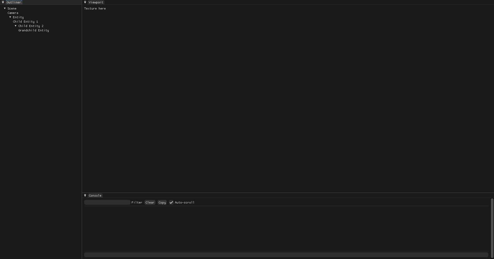
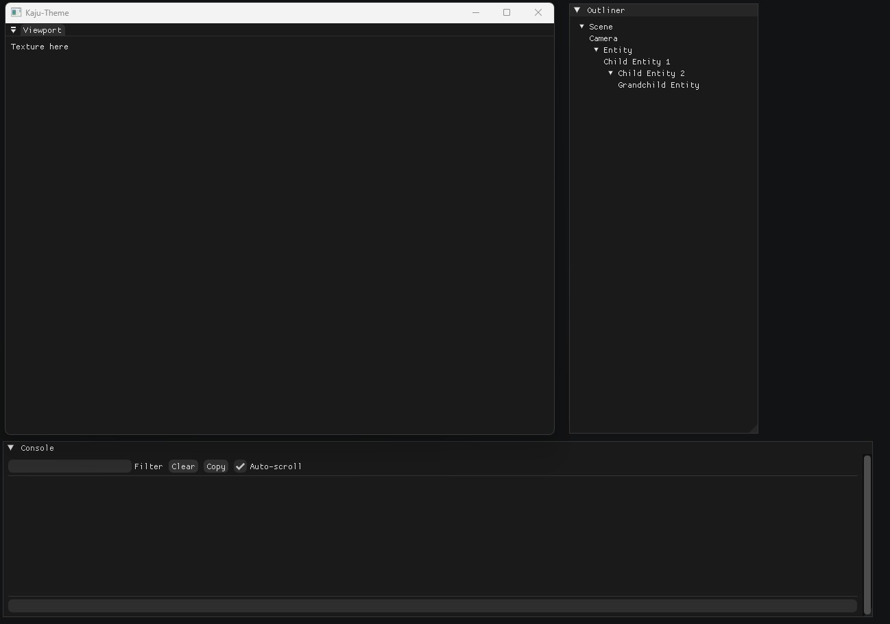

# 🔘 Kaju GUI
This is a Dear ImGUI and Vulkan based project, which shows a mockup of editor UI, project was created to be used as a reference in the future for docking, integrating Dear ImGUI with Vulkan project and layout setup.

You can also use this project as a starting point for any of your vulkan projects.

  
  

## Features
- Docking
- Full ImGUI integration
- Restore to default Layout for first time running
- Unity like editor layout

## Built With
- **Language**: C++ 20
- **Build System**: CMake
- **Third Party**: Vulkan, Dear ImGUI, GLFW, VMA, VK-Bootstrap
- **Platform**: Windows